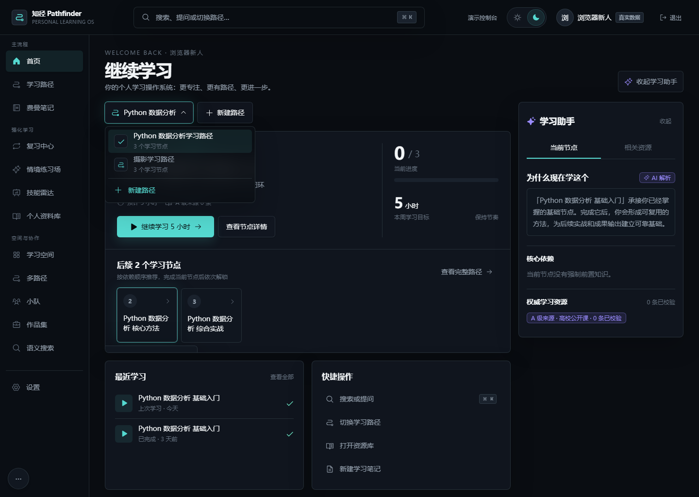
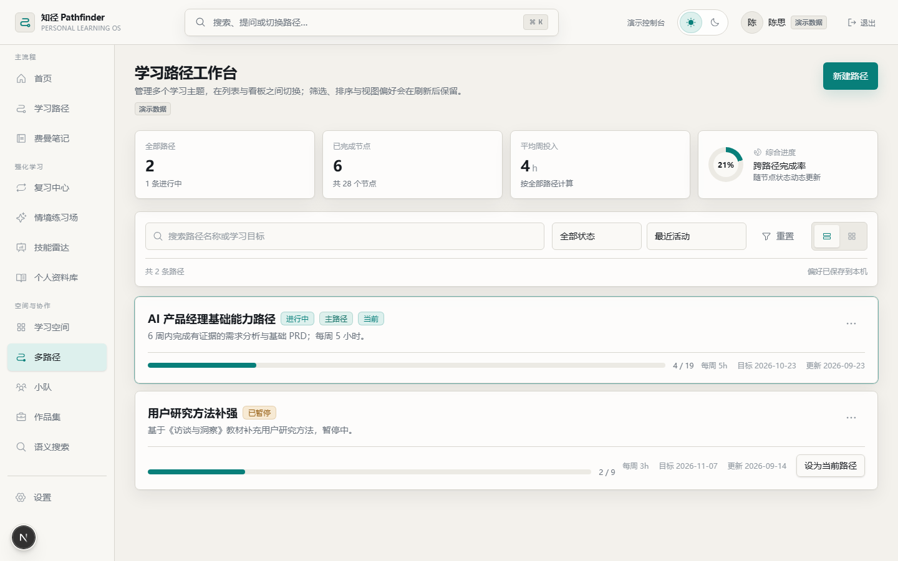
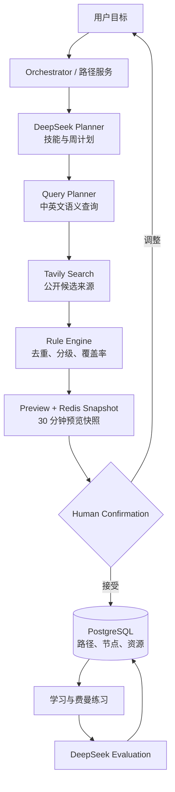
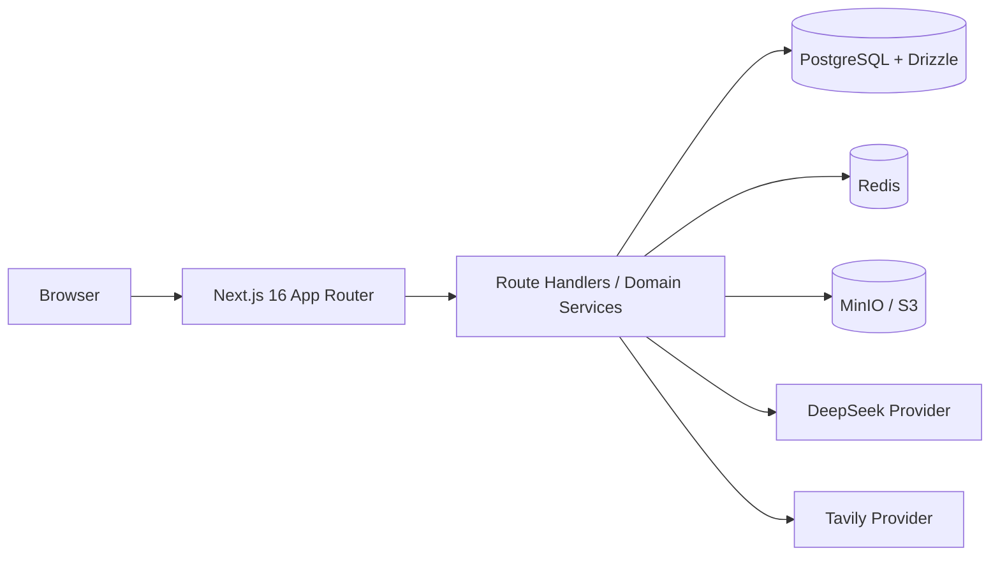

# 知径 Pathfinder · AI 个性化学习路径工作台

> 把“我想学什么”转化为一条有依据、可执行、能验证、可持续调整的学习路径。

[在线体验](https://pathfinder-demoz-v2.vercel.app) · [完整作品集 Case Study](docs/知径Pathfinder-作品集项目说明.md) · [Agent 架构说明](docs/Agent路径生成架构与真实Provider接入说明.md) · [交互验收说明](docs/原型交互能力与验收说明.md)



## 60 秒了解项目

知径 Pathfinder 是我围绕“AI 如何真正帮助用户完成学习，而不只是回答问题”设计并实现的产品。

用户可以输入任意学习主题、具体目标、当前基础、每周时间和期限。系统通过一个有边界的 Agent 工作流完成目标理解、路径编排、查询扩展、公开资料检索、证据分级与学习节点生成；用户确认后，再进入“学习—费曼练习—反馈—复习—作品沉淀”的闭环。

它不是一个课程列表，也不是给聊天框换一层 UI。核心产品判断是：

> 学习问题的瓶颈通常不是“缺少答案”，而是缺少可信的路径、合适的下一步、理解验证和长期可恢复的学习状态。

我在这个项目中承担了产品定义、需求分析、竞品与体验研究、系统/页面 PRD、Agent 工作流设计、交互与视觉设计、前后端实现、数据与部署架构、自动化验收和公网交付。

## 1. 问题定义

自主学习者常见的困难并不是没有资料，而是：

1. **目标模糊**：只知道“想学 Python / 摄影 / 产品经理”，不知道如何拆成有前置关系的能力节点。
2. **资料过载**：课程、视频、文章和书籍很多，但质量、难度、时效和适配性难判断。
3. **路径不可信**：通用大模型可以快速生成目录，却很少说明依据，也可能生成不存在的链接。
4. **看过不等于掌握**：传统产品偏重内容消费，缺少解释、练习和反馈环节。
5. **学习容易中断**：多主题并行时进度、笔记、资料和下一步分散，重新开始的成本很高。

因此，产品需要同时解决“规划可信度”和“学习执行力”，而不是继续增加内容数量。

## 2. 业务需求背景

AI 降低了内容生成成本，却放大了三个产品问题：

- **可信度问题**：模型生成的课程结构和资料是否来自真实来源？
- **执行问题**：用户得到一份漂亮计划后，是否知道今天具体做什么？
- **效果问题**：系统如何判断用户真正理解，而不是只完成了浏览？

知径选择从一个完整学习任务链切入，而不是做“大而全教育平台”。首发用“AI 产品经理能力路径”作为高质量策展样板，同时保留任意主题生成能力，用真实用户输入验证产品是否具备跨主题扩展性。

## 3. 产品目标与非目标

### 产品目标

- 将自然语言学习目标转化为结构化、可调整的学习计划。
- 为关键节点匹配真实候选资料，并展示来源、检索方式和证据覆盖。
- 用费曼追问、复习卡与情境练习验证理解并形成反馈。
- 让多条路径、笔记、资料和作品成为可恢复的个人学习资产。
- 为 Demo 与真实后端提供同一套页面和交互，减少原型到研发的断层。

### 当前非目标

- 不宣称已经覆盖“全网所有数据库”或所有学科的人工认证内容。
- 不把机器筛选的 A/B/C 来源等级包装成专家认证。
- 不在公开 Demo 中使用真实 AI 密钥或承诺生产级教学效果。
- 小队实时协作、机构运营闭环和真正的向量语义检索仍属于 P2 方向。

## 4. 目标用户与核心任务

| 用户 | 核心任务 | 关键痛点 | 产品响应 |
|---|---|---|---|
| 新学习者 | 把模糊兴趣变成可开始的计划 | 不知道从哪里开始 | 四步目标诊断、路径预览、依据说明 |
| 在学学习者 | 找到今天最值得做的任务 | 资料和进度分散 | 当前任务、节点证据、跨页面路径同步 |
| 中断学习者 | 恢复上次状态 | 忘记学到哪里、草稿丢失 | 会话、草稿、笔记和路径状态恢复 |
| 多目标学习者 | 同时管理不同主题 | 新主题覆盖旧进度 | 多路径工作台、当前路径与独立进度 |
| 内容管理员 | 处理失效或低可信资料 | 内容质量难持续维护 | 内容审核和来源治理界面预留 |
| 机构管理员 | 查看合规的群体学习情况 | 隐私与统计边界不清 | 脱敏聚合、角色隔离和最小权限 |

## 5. 功能形式

核心闭环：


已实现的主要模块：

- 任意主题输入与四步目标诊断
- 路径预览、证据覆盖和用户确认
- 多路径创建、切换、搜索、筛选、排序、分页与拖拽看板
- 学习节点、真实来源候选、资料收藏和文件上传
- 五轮费曼练习、三维评价、笔记和复习卡
- 情境练习、技能雷达、作品集和个人资料库
- 五角色一键体验、权限门禁和不同业务状态
- 暗色/浅色双主题及桌面/移动端响应式体验



## 6. 用户旅程

| 阶段 | 用户问题 | 产品触点 | 关键反馈 |
|---|---|---|---|
| 进入 | 这个产品能帮我做什么？ | 落地页、角色体验 | 任意主题、可信路径、费曼验证 |
| 诊断 | 我应该怎么描述目标？ | 四步表单 | 分步输入、即时校验、可返回修改 |
| 预览 | 这条路径靠谱吗？ | 路径确认页 | Provider、检索词、候选资料、覆盖率 |
| 确认 | AI 会不会替我做决定？ | 明确确认动作 | 接受前不写入正式路径 |
| 学习 | 我现在应该做什么？ | 首页、路径树、节点详情 | 当前任务、预计投入、完成标准 |
| 验证 | 我是真的理解了吗？ | 费曼练习 | 单缺口追问、已讲清/待补充/未覆盖 |
| 沉淀 | 学到的东西如何复用？ | 笔记、资料库、作品集 | 按用户与路径持久化 |
| 恢复 | 中断后从哪里继续？ | 首页、多路径工作台 | 当前路径、草稿、进度和下一步恢复 |

## 7. Agent 架构

本项目没有把 Agent 设计成无限自主循环，而是采用“**确定性工作流 + 有边界的模型决策 + 人在回路**”。



### Agent 决策边界

| 环节 | AI 可以决定 | AI 不可决定 |
|---|---|---|
| 学习规划 | 技能名称、学习理由、建议周次 | 数据库 ID、用户权限、是否替用户确认 |
| 查询规划 | 中英文关键词、语义扩展和资料意图 | 外部搜索结果、真实 URL |
| 证据发现 | — | 搜索由 Tavily Provider 执行，模型不能伪造来源 |
| 证据筛选 | — | 来源等级、去重和覆盖率由服务端规则计算 |
| 正式发布 | — | 必须经过用户明确确认 |
| 数据写入 | — | 用户身份只从服务端会话解析，不接收客户端 userId |

## 8. 工作流节点与输入输出

| 节点 | 输入 | 处理 | 输出 | 失败与降级 |
|---|---|---|---|---|
| Goal Intake | 主题、目标、基础、周投入、期限 | Zod 校验与目标结构化 | `LearningGoalInput` | 字段级错误，不进入规划 |
| Plan | 结构化目标、已有节点标题 | DeepSeek 生成技能与周计划 | `GeneratedPlan` | Demo/未配置时使用确定性 Mock |
| Query Plan | 目标、节点标题与描述 | 生成中英文检索查询 | 每节点 2 条有界查询 | 模型失败时回退规则查询 |
| Search | 查询词 | Tavily 公开网络检索 | URL、标题、摘要、来源 | 无 Provider 时标记证据不足 |
| Evidence Grade | 搜索结果 | URL 去重、来源等级和覆盖率 | A/B/C 候选与高/中/低可信度 | 不凭模型自报分数 |
| Preview | 路径与证据 | 组合用户可审查方案 | `previewId`、节点和依据 | Redis 缓存失败不阻断展示 |
| Confirm | 原目标、`previewId` | 校验用户、目标和快照一致性 | 正式路径 | 快照失效时服务端安全重算 |
| Learn | 当前路径与节点 | 提供资源、任务和完成标准 | 学习状态 | 保留空态/错误态/不可用来源提示 |
| Feynman Practice | 节点目标、用户解释、上下文 | 每轮只追一个理解缺口 | 对话与轮次状态 | 草稿本地保存、失败可重试 |
| Evaluate | 五轮对话与节点目标 | 三维结构化评价 | 已讲清、待补充、未覆盖 | Schema 不合法则拒绝伪造评分 |
| Persist | 服务端用户、路径与资产 | SQL 归属过滤、对象存储 | 可恢复学习资产 | 非本人资源统一 404/403 |

## 9. 产品差异化与微创新

| 常见方案 | 知径选择 | 设计原因 |
|---|---|---|
| 固定课程目录 | 用户定义主题，策展模板与 AI 生成双轨 | 同时保留内容质量基线与个性化空间 |
| AI 一次性生成大纲 | 规划、检索、分级、确认分步完成 | 降低黑箱感，允许用户在写入前纠偏 |
| 模型直接推荐链接 | 模型只产查询词，搜索 Provider 返回真实 URL | 避免链接幻觉 |
| 模型自报“可信度 95%” | 按 A/B 来源覆盖率计算高/中/低 | 可信度可解释、可复算 |
| 通用聊天练习 | 绑定节点目标的单缺口费曼追问 | 把对话转化为能力验证 |
| 单一路径覆盖 | 多路径独立状态与当前路径 | 符合真实多目标学习场景 |
| 仪表盘堆满指标 | 首页优先显示一个当前任务 | 降低中断后恢复成本 |
| 暗色样式直接反色 | 浅色使用暖灰层级和柔和阴影 | 保证浅色也有独立的高级感 |

## 10. 技术与数据架构



- **模块化单体**：MVP 阶段降低部署与一致性成本，Provider/Service/领域表保留拆分边界。
- **PostgreSQL**：用户、路径、节点、资源、练习、评价、笔记与作品的权威数据。
- **Redis**：AI 限流、30 分钟路径预览快照及后续任务队列预留。
- **MinIO**：私有学习资料与附件，下载前校验归属并签发短时 URL。
- **双运行模式**：`demo` 用于零配置评审；`api` 用于真实数据库、AI 与搜索联调。
- **容器化**：Docker Compose 统一 Web、PostgreSQL、Redis、MinIO 的本地交付环境。

## 11. 信息架构

```text
知径 Pathfinder
├─ 开始：落地页 / 注册 / 登录 / 一键角色体验
├─ 规划：首页 / 目标诊断 / 路径预览 / 多路径工作台
├─ 学习：知识路径 / 节点详情 / 证据资料
├─ 验证：费曼练习 / 评价结果 / 复习中心 / 情境练习
├─ 沉淀：笔记 / 个人资料库 / 技能雷达 / 作品集
├─ 协作：小队 / 学习空间 / 机构空间（P2）
└─ 治理：内容运营台 / 功能开关 / 健康检查
```

## 12. 验收与工程质量

| 验收项 | 最近结果 |
|---|---:|
| TypeScript | 通过 |
| ESLint | 通过 |
| Next.js production build | 通过，44/44 页面生成 |
| 主题隔离 | 51/51 |
| Demo 浏览器 E2E | 110/110 |
| 真实 API 浏览器 E2E | 36/36 |
| Agent/Provider 验收 | 27/27 |
| 路径工作台专项 E2E | 18/18 |
| PostgreSQL / Redis / MinIO readiness | 全部 ready（本地 API 模式） |
| 桌面 1440px / 移动 390px | 无横向溢出 |
| 客户端密钥模式扫描 | 0 命中 |

自动化测试不仅检查页面能否打开，还覆盖注册、任意主题生成、双路径保留、路径切换、真实 AI 回复、费曼五轮练习、评价、笔记、文件归属、刷新恢复、角色门禁和错误状态。

## 13. 我在项目中体现的能力

- **产品策略**：从“AI 能做什么”转向“用户学习任务哪里断裂”，收敛核心闭环和非目标。
- **需求与 PRD**：完成系统 PRD、页面 PRD、角色权限、状态机、异常态和验收条件。
- **AI 产品设计**：拆分 Planner、Query Planner、Search、Rule Engine 和 Human Confirmation 的边界。
- **可信与安全设计**：来源追踪、证据覆盖、用户确认、服务端身份、限流和密钥隔离。
- **交互设计**：双主题、高信息密度工作台、路径看板、表单反馈、移动端和可访问性。
- **工程实现**：Next.js 全栈、PostgreSQL、Redis、MinIO、Docker 和真实 Provider 接入。
- **质量与交付**：E2E、构建、健康检查、截图 QA、GitHub 版本管理和 Vercel 公网部署。

## 14. 版本范围与路线图

| 阶段 | 范围 | 状态 |
|---|---|---|
| P0 | 目标诊断、路径、证据、费曼练习、评价、笔记、进度 | 已形成真实闭环 |
| P1 | 复习、情境、技能、资料库、作品集、路径工作台 | 已实现主要体验与部分真实数据链 |
| P2 | 小队、同伴反馈、机构运营、内容治理、向量检索 | 页面/协议预留，未全部生产化 |
| Next | 异步 Agent Worker、SSE 进度、pgvector、多来源召回、Agent 可观测性 | 规划中 |

## 15. 公开 Demo 的诚实边界

为了避免公开访问消耗真实模型额度或暴露密钥，Vercel 站点运行在 `demo` 模式：

- AI 为确定性 Mock，路径与交互可完整体验，但不会调用真实 DeepSeek/Tavily。
- 数据保存在访问者自己的浏览器 `localStorage`，不跨设备共享。
- 页面会明确显示“演示数据”；这是产品边界提示，不是异常。
- 真实 API 模式已在本地通过 PostgreSQL、Redis、MinIO、DeepSeek、Tavily 链路验收。

## 16. 本地运行

### 零配置 Demo

```bash
npm install
npm run dev
```

访问 `http://localhost:3000`。

### 完整前后端

```powershell
Copy-Item .env.example .env
docker compose up --build
```

服务包括 Web、PostgreSQL、Redis 和 MinIO。真实 Provider 密钥只能通过服务端环境变量配置，禁止写入代码、提交到 Git 或使用 `NEXT_PUBLIC_*` 暴露。

### 验证命令

```bash
npm run typecheck
npm run lint
npm run build
npm run test:topic
npm run test:e2e:demo
npm run test:e2e:api
npm run test:e2e:infra
npm run test:e2e:paths
```

## 17. 项目结构

| 路径 | 说明 |
|---|---|
| `app/` | 页面路由与服务端 Route Handlers |
| `components/` | 布局、主题、反馈、弹窗、抽屉与业务组件 |
| `lib/` | Agent、Provider、领域服务、认证和基础设施适配 |
| `db/` | Drizzle 数据迁移 |
| `scripts/` | Seed、验收和本地启动脚本 |
| `tests/e2e/` | Demo、API、基础设施与专项浏览器验收 |
| `docs/` | 产品审计、实施契约、Agent 架构和交付证据 |

---

如果你是面试官，建议按这个顺序体验：**落地页 → 一键进入“新学习者” → 创建任意主题路径 → 查看路径依据 → 切换多路径 → 进入节点 → 完成费曼练习 → 查看复习与作品沉淀**。
