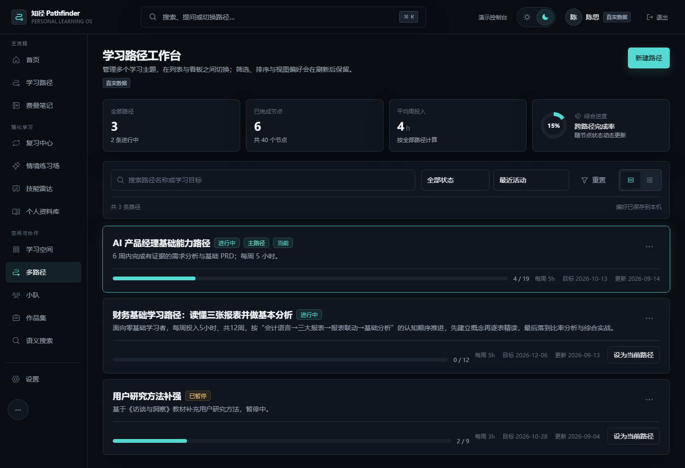
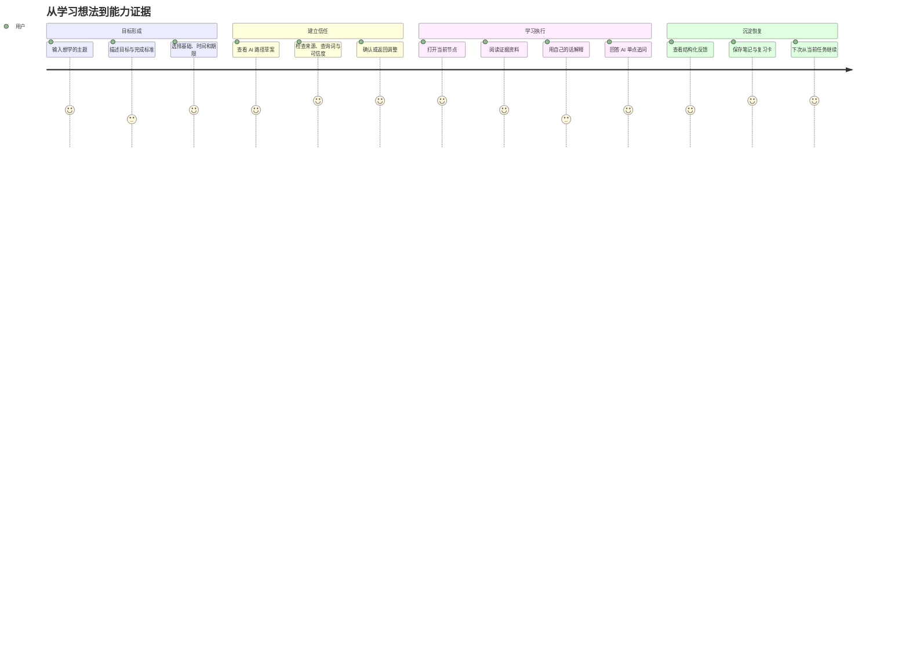

# 知径 Pathfinder｜AI 产品经理作品集 Case Study

> 项目类型：AI 教育产品 / 个性化学习 Agent / 全栈可交互 Demo  
> 当前版本：DemoZ V2.1  
> 在线体验：https://pathfinder-demoz-v2.vercel.app  
> 我的角色：产品经理、AI 工作流设计、交互设计、全栈实现与质量验收  
> 项目状态：P0 主闭环已真实连通，P1 主要体验已实现，P2 部分为交互与协议预留

## 一、项目摘要

知径 Pathfinder 试图解决一个比“如何生成课程”更本质的问题：当用户面对一个新的学习目标时，如何获得一条可信、适配、可执行，而且能验证是否真正学会的路径。

我没有把产品做成“AI 问答 + 课程推荐”，而是把 AI 拆进学习任务链路：目标理解、能力拆分、查询规划、资料发现、证据筛选、路径确认、费曼练习与结构化评价。模型只在适合它的环节做概率性判断；用户身份、权限、来源 URL、证据覆盖、数据写入和正式确认由确定性系统控制。

最终形成两个交付层级：

- 公网 Demo：免注册即可体验完整产品逻辑，使用 Mock 和浏览器本地数据，不消耗真实模型额度。
- 本地 API 模式：使用 PostgreSQL、Redis、MinIO、DeepSeek 和 Tavily，验证真实前后端与 Agent 链路。

## 二、我为什么做这个产品

### 2.1 观察到的用户问题

当用户说“我想学数据分析”时，真正的任务并不是让 AI 回答“什么是数据分析”，而是连续完成这些决策：

1. 学到什么程度才算完成？
2. 现有基础与目标之间差哪些能力？
3. 哪些能力有前置关系，先后顺序是什么？
4. 每周只有有限时间，节奏如何安排？
5. 哪些资料真的存在，并且适合当前阶段？
6. 用户看完之后，如何验证是否理解？
7. 中断一周后，如何低成本恢复？

传统课程平台主要解决第 5 个问题中的“内容供给”，通用大模型主要解决即时问答，而从目标到能力证据的完整链路仍然割裂。

### 2.2 业务机会

AI 时代内容越来越便宜，产品竞争力会从“谁有更多内容”转向：

- 谁能理解具体目标并给出可行动的下一步；
- 谁能解释推荐依据并处理不确定性；
- 谁能让学习行为产生可恢复、可验证的资产；
- 谁能把模型能力放进稳定的业务工作流，而不是依赖一次性 Prompt。

因此我把产品价值定义为“个人学习操作系统”，而不是另一个内容商城。

## 三、需求定义

### 3.1 核心 JTBD

> 当我想学习一个新主题、但不知道如何开始时，我希望系统根据我的目标、基础与时间，给出一条有真实资料依据的路径，并在学习过程中验证我的理解，这样我能持续推进，而不是收藏一堆资料后放弃。

### 3.2 核心需求优先级

| 优先级 | 需求 | 为什么优先 |
|---|---|---|
| P0 | 目标诊断 | 输入质量决定后续路径质量 |
| P0 | 路径生成与用户确认 | 核心价值与人机决策边界 |
| P0 | 来源证据与可信度 | 解决 AI 黑箱和链接幻觉 |
| P0 | 节点学习与费曼练习 | 将“计划”转化为“掌握” |
| P0 | 进度、笔记和恢复 | 支撑持续使用，而非一次性生成 |
| P1 | 多路径管理 | 用户往往同时学习多个主题 |
| P1 | 复习、技能与作品 | 将学习记录升级为能力证据 |
| P1 | 资料库与文件 | 形成个人学习资产中心 |
| P2 | 小队、同伴与机构 | 需要先验证个人闭环再扩张 |

### 3.3 产品原则

1. **用户拥有最终决定权**：预览与正式写入分离，AI 不能自动发布路径。
2. **模型不能伪造事实**：模型生成搜索查询，不生成外部 URL。
3. **不确定性必须可见**：展示 Provider、检索词、证据覆盖与高/中/低可信度。
4. **先给下一步，再给全景**：首页优先当前任务，路径页承载完整结构。
5. **数据状态必须可恢复**：草稿、练习、笔记、资料和路径都围绕恢复设计。
6. **演示能力与真实能力分开标注**：Mock、P2 预留和真实 API 不混为一谈。

## 四、目标用户与角色体系

### 4.1 核心用户画像

**转行或自我提升的知识工作者**

- 有明确或半明确的学习意愿；
- 时间碎片化，需要清楚的优先级；
- 会搜索资料，但缺少内容判断和结构化规划能力；
- 对 AI 感兴趣，同时担心内容幻觉与不可靠建议；
- 需要把学习结果转化为作品或求职证据。

### 4.2 五角色体验设计

| 角色 | 初始状态 | 用于验证的产品问题 |
|---|---|---|
| 新学习者·林然 | 无路径 | 冷启动和目标诊断是否清晰 |
| 在学学习者·陈思 | 有路径与进度 | 日常恢复与当前任务是否明确 |
| 练习中学习者·周宁 | 有未完成会话 | 中断、草稿和失败恢复是否可信 |
| 内容管理员·陈岚 | 有审核队列 | 内容质量治理如何进入系统 |
| 机构管理员·张磊 | 有聚合数据 | 权限、隐私和组织视角如何隔离 |

公网 Demo 使用一键角色入口，让评审者不必准备数据即可查看不同业务状态。API 模式下，该入口由后端签发隔离会话，并可通过环境开关关闭。

## 五、产品方案

### 5.1 核心功能地图

```text
目标层
├─ 任意主题输入
├─ 目标与完成标准
├─ 当前基础
└─ 时间与期限

规划层
├─ AI 技能拆解
├─ 前置关系与周计划
├─ 查询规划
├─ 资料检索与分级
└─ 路径预览与确认

执行层
├─ 当前任务
├─ 节点详情
├─ 资料证据
├─ 费曼练习
└─ 情境练习

反馈层
├─ 三维评价
├─ 复习卡
├─ 技能证据
└─ 自适应调整建议

资产层
├─ 多路径
├─ 笔记
├─ 个人资料库
├─ 上传文件
└─ 作品集
```

### 5.2 为什么不是“大而全课程平台”

MVP 的验证对象是“AI 编排与学习闭环是否成立”，而不是供给侧内容规模。因此内容商城、直播、支付、教师工作台和完整机构 SaaS 没有进入首发主链路。这样可以把研发和评审注意力集中在四个关键风险：

- 目标是否被正确理解；
- 路径是否可信；
- 用户是否能开始行动；
- 学习是否产生可验证反馈。

### 5.3 多路径工作台

早期版本虽然能创建多条路径，但更像一个结果列表。为了适应真实多目标学习，我补充了：

- 动态路径数、完成节点、平均投入和综合进度；
- 关键词搜索、状态筛选、四种排序与分页；
- 列表和拖拽看板双视图；
- 详情抽屉、编辑弹窗、归档确认和结果 Toast；
- 当前路径、主路径、暂停、完成与归档的明确状态；
- 非破坏性归档，保留节点、资料、练习和作品。



## 六、用户旅程与关键决策

### 6.1 主旅程



### 6.2 关键时刻设计

**路径确认前**

用户最容易产生“不知道 AI 靠不靠谱”的疑问。因此确认页不只展示节点标题，还展示：

- 规划模型与搜索 Provider；
- Agent 扩展出的查询词；
- 核心节点是否找到 A/B 级候选来源；
- 证据覆盖摘要和规则计算的可信度；
- 每个节点的真实候选链接。

**学习中断后**

用户重新进入时，不要求重新浏览完整仪表盘。首页直接展示当前路径、当前节点、预计投入和继续动作；练习草稿区分本地、同步中、已保存和失败。

**评价时**

不输出看似精确的“82 分”，而是使用“已讲清、待补充、尚未覆盖”，并把反馈绑定到当前节点的能力目标。

## 七、Agent 产品架构

### 7.1 设计思想

Agent 的价值不是让模型控制更多，而是让复杂任务被拆成可观测、可验证、可恢复的步骤。

我采用有界编排：

- LLM 负责语义理解与生成；
- 搜索 Provider 负责返回真实候选来源；
- 规则引擎负责确定性评分和约束；
- 数据服务负责权限、ID 和状态；
- 用户负责不可逆的确认。

### 7.2 Agent 组件

| 组件 | 职责 | 设计理由 |
|---|---|---|
| Goal Normalizer | 把用户输入转为稳定 Goal Schema | 防止 Prompt 直接吞自然语言造成字段漂移 |
| Planner | 生成技能、理由、周计划 | 利用模型的知识组织能力 |
| Query Planner | 为节点生成中英文语义查询 | 扩大中外资料召回，不允许生成 URL |
| Search Adapter | 调用 Tavily | 把事实发现从语言生成中分离 |
| Evidence Grader | 去重、来源分级、覆盖率 | 结果可复算，避免模型自信分数 |
| Preview Cache | 保存用户看到的方案 | 确认时不因二次模型调用发生节点漂移 |
| Path Materializer | 生成确定性 ID 并写库 | 保证幂等、归属和数据一致性 |
| Practice Agent | 单缺口费曼追问 | 控制对话目标和认知负荷 |
| Evaluation Agent | 输出结构化三维反馈 | 支撑复习、技能和作品链路 |

### 7.3 工作流节点 I/O 契约

#### 节点 1：Goal Intake

- 输入：`topic`、`goal`、`currentLevel`、`weeklyHours`、`deadlineWeeks`、偏好。
- 输出：通过 Zod 校验的 `LearningGoalInput`。
- 约束：缺字段、超范围或空主题直接返回字段级错误。

#### 节点 2：Planning

- 输入：`LearningGoalInput`、已有知识节点标题。
- 输出：标题、规划理由、技能列表、周计划、Provider 标签。
- 约束：模型不可输出数据库 ID；服务端生成稳定 `gen-*` ID。

#### 节点 3：Query Planning

- 输入：主题、目标、水平、单个节点标题和描述。
- 输出：每节点最多两条中文/英文语义查询。
- 约束：查询数量有上限；模型失败时使用确定性规则查询。

#### 节点 4：Search

- 输入：查询词。
- 输出：真实 URL、标题、摘要和来源域名。
- 约束：不绕过登录、付费墙或访问限制；无 Provider 时明确降级。

#### 节点 5：Evidence Processing

- 输入：候选搜索结果。
- 输出：去重后的资料、A/B/C 来源等级、节点覆盖与路径可信度。
- 规则：A/B 覆盖 ≥80% 为高，≥50% 为中，其余为低。

#### 节点 6：Preview

- 输入：路径草案和证据。
- 输出：用户可审查的路径、`previewId` 和 30 分钟 Redis 快照。
- 约束：预览不写正式路径；缓存失败不阻断用户查看。

#### 节点 7：Confirmation

- 输入：原始目标和 `previewId`。
- 输出：正式路径或安全重算结果。
- 约束：用户归属、目标字段与快照必须一致；消费后删除快照。

#### 节点 8：Practice and Evaluation

- 输入：节点目标、用户五轮解释和上下文。
- 输出：追问、已讲清、待补充、未覆盖、下一步建议。
- 约束：结构化 Schema 不完整时拒绝伪造默认分数。

## 八、信息架构与页面策略

### 8.1 信息架构

全局导航按用户任务而不是技术模块组织：

- 主流程：首页、学习路径、费曼笔记；
- 强化学习：复习、情境、技能、资料；
- 空间与协作：学习空间、多路径、小队、作品、搜索；
- 管理：内容运营、机构空间和演示控制台。

### 8.2 页面状态规范

每个核心页面都考虑：

- 正常、加载、空数据、失败、无权限；
- Demo 与 API 数据来源标识；
- 网络/AI 故障和证据不足；
- 提交中、防重复提交与结果 Toast；
- 390px 移动端和 1440px 桌面端；
- 键盘焦点、Esc、遮罩关闭与 Focus Trap。

### 8.3 双主题设计

视觉基线是 Linear 风格的“Graphite Command Center”：

- 暗色用近黑背景、表面明度阶梯、半透明细边界和克制的青色行动色；
- 浅色没有简单反色，而使用暖灰画布、实体卡片、柔和阴影与低饱和层级；
- 状态不只依赖颜色，同时使用文字、标签和操作反馈。

## 九、技术架构与关键取舍

### 9.1 为什么选择 Next.js 模块化单体

MVP 的核心风险是产品价值和 Agent 质量，而不是服务规模。模块化单体可以：

- 共用类型和校验，减少前后端契约漂移；
- 简化部署、事务和用户会话；
- 通过 Provider 与 Domain Service 保留未来拆分边界；
- 支持 Demo 与 API 两种模式复用同一套交互。

相比提前拆微服务，这一选择更符合当前验证阶段。

### 9.2 数据职责

| 组件 | 当前职责 | 后续扩展 |
|---|---|---|
| PostgreSQL | 用户、路径、节点、资源、练习、评价、笔记、作品 | pgvector、Agent 运行记录、审计日志 |
| Redis | 限流、预览快照 | BullMQ、Checkpoint、SSE 事件 |
| MinIO | 私有文件与短时下载 | PDF、网页快照、字幕和恶意文件扫描 |
| DeepSeek | 规划、查询扩展、练习、评价 | 路径审查和动态重规划 |
| Tavily | 公开候选来源发现 | 多 Provider 联合召回 |

### 9.3 安全与隐私

- 会话使用 HttpOnly Cookie，数据库只存会话 Token 哈希；
- 所有用户数据查询从服务端会话解析 `userId`；
- 非本人路径和资源在 SQL 层过滤；
- 上传限制大小和 MIME，对象键包含用户与路径归属；
- 下载前二次验证所有权，再签发短时预签名链接；
- AI 接口要求登录、限制输入大小并通过 Redis 限流；
- 真实密钥不进入客户端、Git、截图或公网 Demo。

## 十、产品指标设计

项目当前以交付验收为主，下一步试点应重点观察：

### 北极星候选

**每周完成一次“有证据的学习闭环”的活跃用户数**

闭环定义：打开节点 → 使用至少一个资料或完成任务 → 完成费曼练习/情境练习 → 保存反馈或笔记。

### 漏斗指标

| 阶段 | 指标 |
|---|---|
| 激活 | 目标诊断完成率、路径预览率、路径确认率 |
| 信任 | 来源展开率、外链访问率、低可信路径返回修改率 |
| 执行 | 首节点启动率、节点 7 日完成率、当前任务点击率 |
| 学习效果 | 费曼练习完成率、待补充项二次通过率、复习完成率 |
| 留存 | 7 日恢复率、多路径切换后继续学习率 |
| 资产 | 有效笔记数、资料复用率、作品生成率 |

### Agent 质量指标

- 规划 Schema 成功率；
- 每节点有效来源数与 A/B 覆盖率；
- 用户接受路径比例及修改原因；
- Provider 延迟、失败率、Token 与搜索成本；
- 同主题重复生成的一致性；
- 专家抽检的节点顺序、难度和资料相关性。

## 十一、验证与质量保障

### 11.1 自动化验收

| 套件 | 覆盖 | 结果 |
|---|---|---:|
| 主题隔离 | 任意主题、稳定 ID、跨主题内容污染 | 51/51 |
| Demo E2E | 8 条浏览器主链路、角色、主题、多路径、响应式 | 110/110 |
| API E2E | 注册、双路径、练习、评价、笔记、会话恢复 | 36/36 |
| Agent 验收 | DeepSeek、Tavily、预览证据和确认一致性 | 27/27 |
| 路径工作台 | 搜索、筛选、看板、表单、localStorage、移动端 | 18/18 |

### 11.2 我特别验证的风险

- Demo 模式不会误发真实 AI 请求；
- 页面 DOM、构建脚本和日志不包含密钥模式；
- 预览与确认节点不会因二次模型调用漂移；
- 两条路径同时存在，不覆盖旧进度；
- 用户无法读取其他人的路径和文件；
- 真实上传进入对象存储，数据库只保存受控元数据；
- 桌面端和移动端无横向溢出；
- 401 会话探测与真正页面异常被测试正确区分。

## 十二、迭代过程中的关键问题与修复

| 问题 | 根因 | 修复与产品意义 |
|---|---|---|
| 产品被固定成 AI 产品经理课程 | 模板数据被当作产品边界 | 改为任意主题输入，模板只作为高质量样板 |
| 第二条路径覆盖或冲突 | 主路径与当前路径概念混淆 | 第一条为主路径，后续并行保存；当前路径独立选择 |
| 新主题找不到资料 | 模型生成目录但没有真实检索闭环 | Query Planner + Tavily + 证据覆盖与降级 |
| 用户不知道路径是否可靠 | 只展示功能结果，不展示生成依据 | 确认前展示 Provider、查询词、候选来源和可信度 |
| 预览和确认结果变化 | 确认时再次调用模型 | Redis 保存用户看到的预览快照并复用 |
| 评价偶发回退 Mock | 模型字段命名轻微漂移 | 兼容合法别名，但缺失信息继续拒绝伪造 |
| 本地显示 API、实际是 Demo | `NEXT_PUBLIC_*` 在构建时固化 | 构建阶段明确数据源，并增加文档与 E2E 判别 |
| 暗色高级、浅色普通 | 把暗色玻璃效果直接反色 | 为浅色重新设计暖灰、阴影和实体层级 |

## 十三、范围边界与风险

### 已知边界

- 真实搜索是候选发现和机器初筛，不等同于人工认证课程库；
- Tavily 不是“全网所有数据库”，中文专业来源仍需专用适配器；
- 当前保存链接和必要元数据，不抓取未经授权的全文；
- 公网 Demo 是 Mock，不调用真实 DeepSeek 和 Tavily；
- P2 的小队、同伴、机构和内容治理尚未形成完整生产后端；
- 当前语义搜索名称对应文本检索能力，pgvector 尚未加入生产链路。

### 风险与对策

| 风险 | 对策 |
|---|---|
| AI 路径看似合理但教学顺序错误 | 专家评测集、前置关系校验、用户确认与版本回滚 |
| 来源失效或质量下降 | 可访问性巡检、更新时间、替换队列和人工抽检 |
| 生成时间过长 | BullMQ 异步任务、SSE 进度、取消和断点恢复 |
| 公开服务被滥用 | 认证、限流、预算、Provider 路由和使用台账 |
| 用户把评价当权威结论 | 使用分级反馈与不确定性说明，不输出伪精确分数 |
| 隐私和文件安全 | 最小权限、对象隔离、短时 URL、恶意文件扫描 |

## 十四、下一阶段规划

### P0：Agent 可观测与异步化

- `agent_runs / agent_steps / tool_calls / usage_ledger` 数据表；
- BullMQ Worker、Checkpoint、取消、重试和超时；
- SSE 展示真实步骤进度，而不是前端假进度；
- 记录模型、提示版本、耗时、Token、搜索次数和失败原因。

### P1：检索与内容质量

- 接入 OpenAlex、Crossref、Semantic Scholar 与公开课专业来源；
- pgvector + 关键词 + 来源权重的混合召回；
- 网页、PDF 元数据和公开视频字幕的合规解析；
- URL 可访问性、时效、难度与交叉来源一致性评分。

### P2：学习效果与协作

- 固定评测集和专家抽检；
- 用户对路径节点的编辑和反馈反哺；
- 同伴反馈、小队任务和机构版灰度验证；
- 跨设备当前路径与离线状态同步。

## 十五、项目复盘

### 做对的事

1. 把产品从“固定产品经理课程”纠正为“任意主题学习路径”，同时保留策展模板作为质量基线。
2. 没有让大模型直接生成链接和可信度，把事实与规则交给工具和确定性服务。
3. 预览、确认、写库分离，使人机边界清楚且可回滚。
4. 从 PRD、页面、数据到 E2E 使用同一套主题、角色和状态定义。
5. 公网 Demo 与真实 API 模式分开，既便于作品展示，也不暴露密钥和真实成本。

### 如果重新开始

1. 更早建立唯一事实源，避免“首发模板”和“任意主题”在多份 PRD 中漂移。
2. 在第一个 Agent 版本就加入运行日志和成本台账，而不是只看最终输出。
3. 把路径质量评测集与用户研究同步启动，避免工程通过被误认为教学效果已经成立。
4. 更早定义 P0/P1/P2 的真实数据口径，防止高保真页面被误认为后端已经完成。

## 十六、面试讲述建议

### 30 秒版本

> 我做了一个 AI 个性化学习路径工作台。它解决的不是内容不足，而是用户不知道怎么规划、资料是否可信以及看完是否真正掌握。我把大模型拆成 Planner 和 Query Planner，真实链接由搜索服务返回，可信度由规则计算，正式路径必须由用户确认。产品已完成任意主题、多路径、费曼练习、资料库和真实全栈链路，并通过自动化 E2E 和 Vercel 公网 Demo 交付。

### 3 分钟版本

建议按以下顺序讲述：

1. 先讲用户问题：目标模糊、资料过载、路径不可信、缺少理解验证；
2. 再讲产品闭环：诊断—路径—证据—费曼—反馈—资产；
3. 解释最大差异：模型不生成 URL、规则计算可信度、用户确认后才写库；
4. 展示两个关键页面：路径确认页和多路径工作台；
5. 说明工程能力：Next.js、PostgreSQL、Redis、MinIO、DeepSeek、Tavily、Docker；
6. 用测试结果证明不是静态稿；
7. 主动说明公网 Demo 是 Mock、P2 未全部生产化；
8. 最后讲下一阶段的 Agent 可观测性和学习效果验证。

## 十七、相关资料

- [仓库首页与运行说明](../README.md)
- [Agent 路径生成架构](Agent路径生成架构与真实Provider接入说明.md)
- [实施契约](IMPLEMENTATION-CONTRACT.md)
- [产品审计与改进方案](当前产品审计与DemoZ-V2改进方案.md)
- [原型交互能力与验收](原型交互能力与验收说明.md)
- [交付与验收报告](本次交付与验收报告.md)

---

这个项目最终要证明的不是“我会调用一个大模型 API”，而是我能够从用户问题出发，定义 AI 与确定性系统的边界，把产品决策落实到交互、数据、权限和验收，并诚实地交付一个别人可以实际体验的产品。
